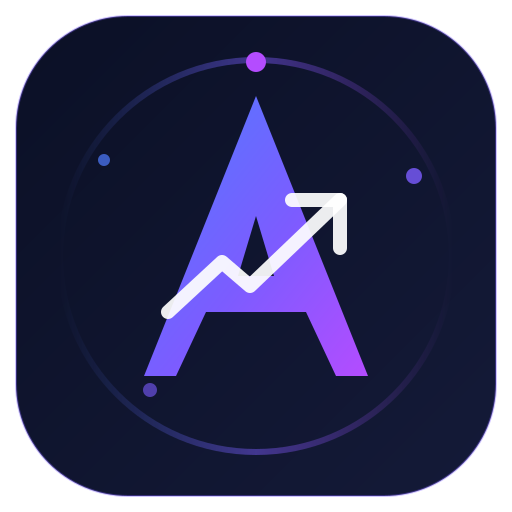
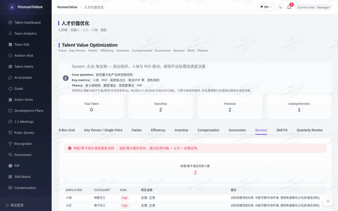
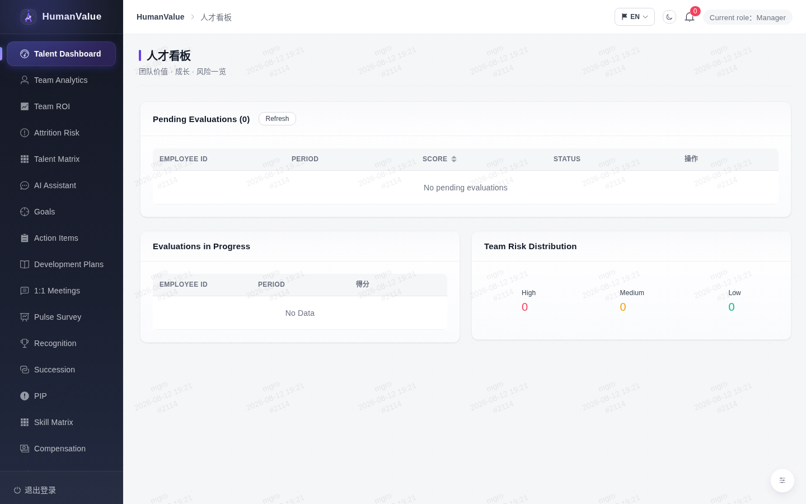
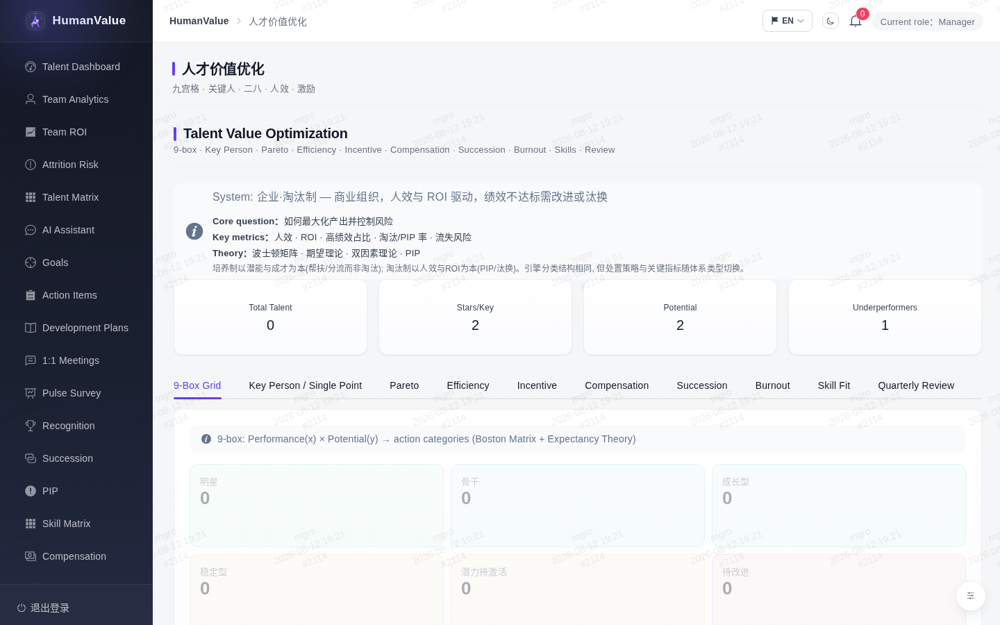
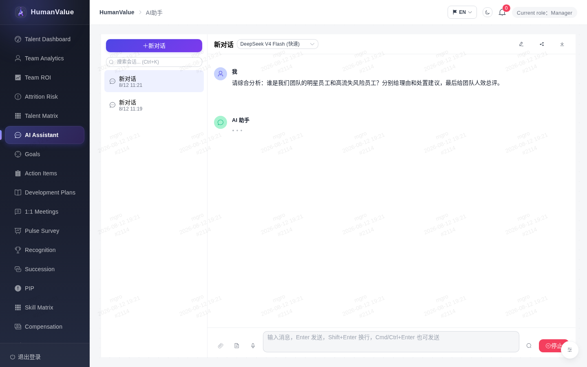
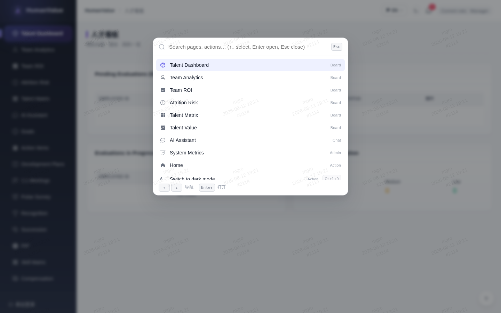
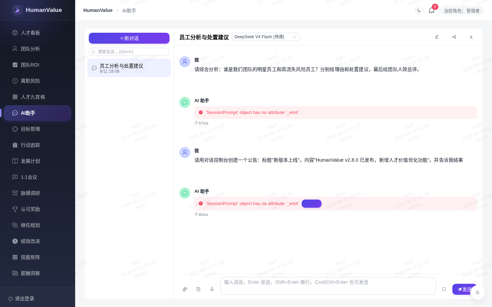
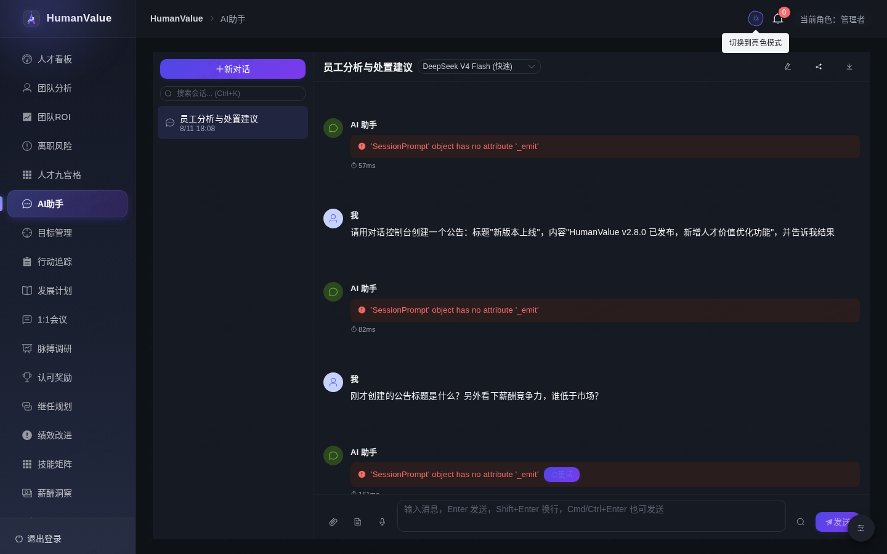

<p align="center">
  
</p>

<h1 align="center">HumanValue</h1>

<p align="center">
  <strong>人才价值智能化平台</strong><br/>
  对话式 AI · 智能体工具 · 自动化绩效评估 · 多视角评估系统
</p>

<p align="center">
  <a href="LICENSE"></a>
  
  
  
  
  
  <a href="CHANGELOG.md"></a>
</p>

<p align="center">
  <strong>选择语言:</strong> <a href="README.md">English</a> · <a href="README.zh-CN.md">中文</a> · <a href="README.ja-JP.md">日本語</a>
</p>

<p align="center">
  
</p>

---

**HumanValue** 是一套以 AI 驱动的人才价值量化与成长平台，融合对话式智能体、完整智能体工具链与自动化多视角评估，帮助管理者与 HR 理解、发展并最大化每一位人才的价值。界面**以英文为主**，可切换**中文 / 日本語**。

---

## 核心能力

- **对话式 AI 与智能体控制台** — AI 助手同时也是系统控制台：直接在对话中完成人才分析、发布公告、管理工单、运行数据管道、创建备份等全部操作。
- **人才价值引擎** — 10 项理论驱动的分析：人才九宫格分类、关键人 / 单点依赖风险、二八价值集中度、团队人效、激励策略、薪酬竞争力、继任梯队、倦怠预警、技能匹配与再配置、季度复盘。
- **多体系类型** — 同一引擎适配不同机构语境：企业（淘汰制）、高校（培养制）、事业单位（职级晋升制）、培训（技能认证制）、平台（灵活用工制）。
- **企业级治理** — MFA 双因子、登录风控、公告、工单、数据资产、数据管道、容灾备份、AI 安全红队。
- **通用智能体能力** — ReAct 循环、规划器、反思器、多智能体监督者、MCP 客户端/服务器、A2A 协议、浏览器自动化、技能、记忆与 RAG、SSE 流式、上下文压缩等。

## 产品预览

| 人才看板 | 人才价值引擎 | AI 助手（对话控制台） |
|:---:|:---:|:---:|
|  |  |  |

| 命令面板 | 对话创建公告 | 暗色模式 |
|:---:|:---:|:---:|
|  |  |  |

> 完整走查见 [演示展示](docs/demo-showcase.md)。

## 系统架构

- **前端**：Vue 3 · Pinia · Element Plus · ECharts · KaTeX · Mermaid
- **后端**：Python 3.11+ · FastAPI · SQLAlchemy · Alembic
- **智能体**：LangGraph · ReAct · LangChain 工具 · MCP · A2A
- **模型供应商**：OpenAI / Anthropic / Gemini / DeepSeek / Qwen / Ollama（凭据加密、负载均衡）
- **存储**：SQLite（开发）/ PostgreSQL（生产）· ChromaDB · Redis · MinIO
- **可观测性**：Prometheus · Langfuse · Grafana · Loki

## 快速开始

### Docker Compose（推荐）

```bash
git clone https://github.com/weed33834/HumanValue.git
cd HumanValue
cp backend/.env.example backend/.env   # 设置 JWT_SECRET_KEY 与模型 API Key
docker compose up -d --build
```

### 本地开发

```bash
# 后端
cd backend && pip install -r requirements.txt
uvicorn main:app --reload --port 8000

# 前端
cd frontend && npm install && npm run dev   # http://localhost:5173
```

### 无需 API Key（Mock 模式）

```bash
cd backend && uvicorn main:app --reload --port 8000
python -m eval.evaluate --mock
```
未配置 LLM API Key 时，系统自动降级为确定性 Mock Provider，使完整流程可端到端运行。

## 演示

完整录屏、界面截图与宣传动图见 [演示展示](docs/demo-showcase.md)。

## 文档

| 文档 | 说明 |
|---|---|
| [演示展示](docs/demo-showcase.md) | 完整录屏与截图 |
| [通用智能体能力清单](docs/universal-agent.md) | 通用 Agent 能力全核对 |
| [完整版能力说明](docs/m14-m18-capabilities.md) | 能力与 API |
| [对话控制台指南](docs/chat-console.md) | 如何在对话中操作系统 |
| [快捷键与使用技巧](docs/shortcuts.md) | 全局快捷键与技巧 |
| [错误码手册](docs/error-codes.md) | 统一错误码与排查 |
| [智能体陷阱与防护](docs/agent-pitfalls.md) | 常见坑与防复发 |
| [上线就绪检查清单](docs/launch-checklist.md) | 发布前逐项验证 |
| [更新日志](CHANGELOG.md) | 版本历史 |

## 仓库

| 平台 | 地址 |
|---|---|
| GitHub（主仓库） | https://github.com/weed33834/HumanValue |
| GitCode（镜像） | https://gitcode.com/badhope/HumanValue |
| Gitee（镜像） | https://gitee.com/badhope/HumanValue |

## 许可证

Apache License 2.0。详见 [LICENSE](LICENSE)。
