# HumanValue 演示展示

> 完整操作录屏与界面截图，展示系统全功能。

## 完整演示录屏（精华版）
模拟鼠标键盘全程走查：落地页 → 登录 → 看板 → 命令面板 → 人才价值优化（全部标签）→ AI 助手对话控制台（多轮真实对话+工具调用）→ 暗色模式 → 快捷键 → 404。

<video controls width="100%" src="assets/demo/humanvalue-demo.mp4"></video>
> 若视频无法内嵌播放，请下载 `docs/assets/demo/humanvalue-demo.mp4` 查看。

## 界面截图

| 落地页 | 登录/看板 | 命令面板 |
|:---:|:---:|:---:|
| 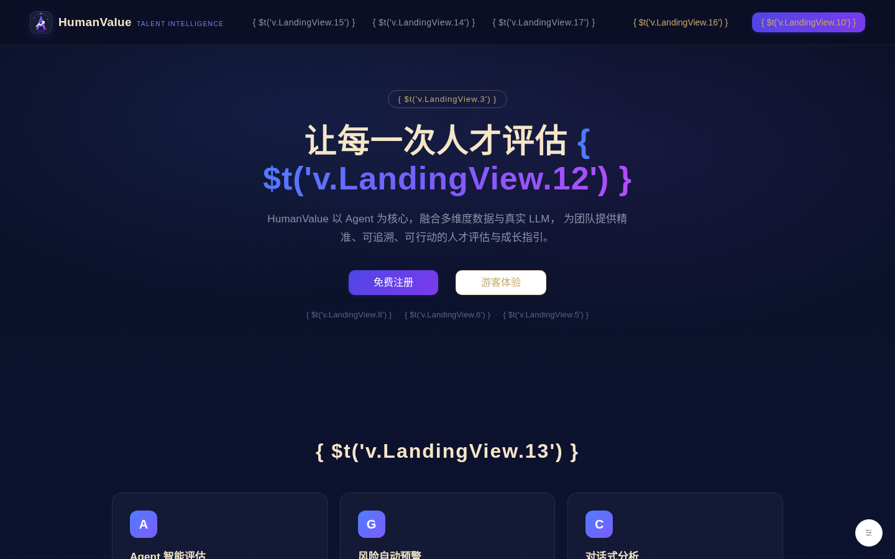 |  |  |

### 人才价值优化（10 个分析标签）
| 九宫格 | 关键人 | 二八 |
|:---:|:---:|:---:|
|  | 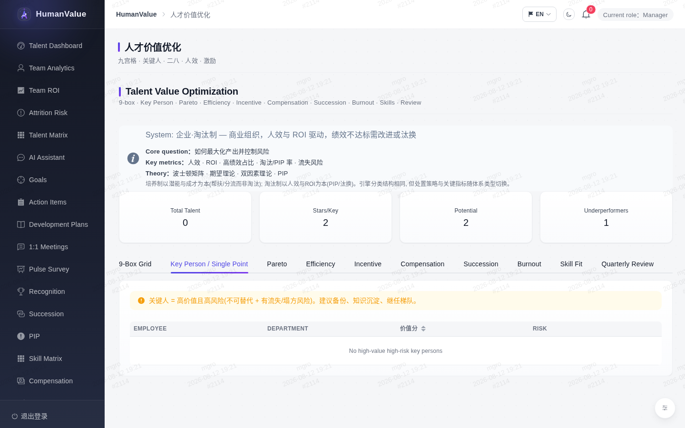 | 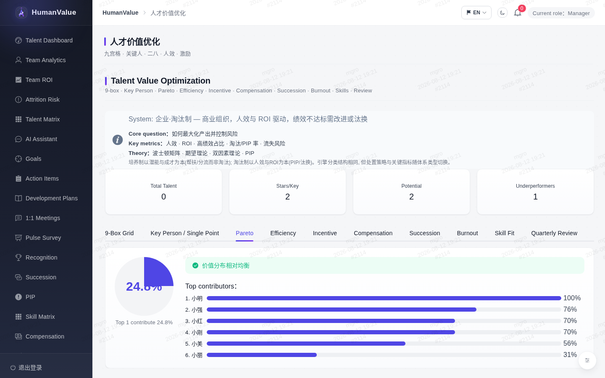 |

| 人效 | 激励 | 薪酬 |
|:---:|:---:|:---:|
| 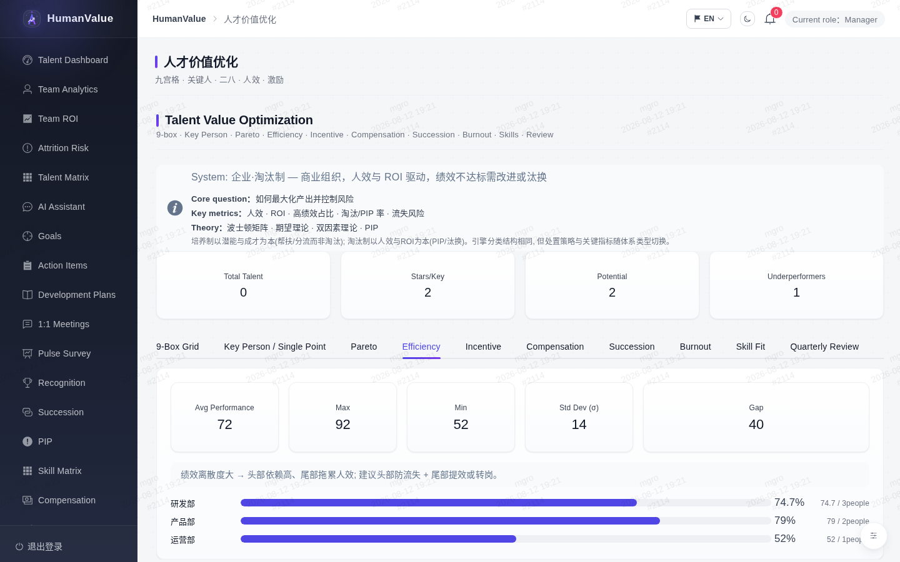 | 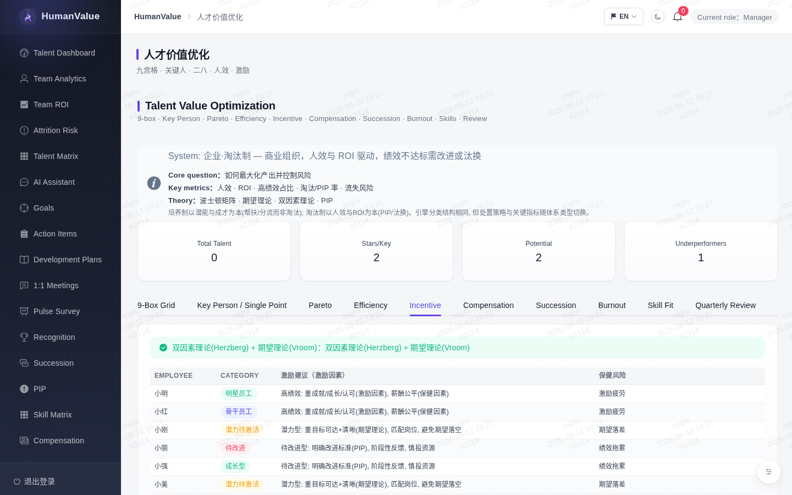 | 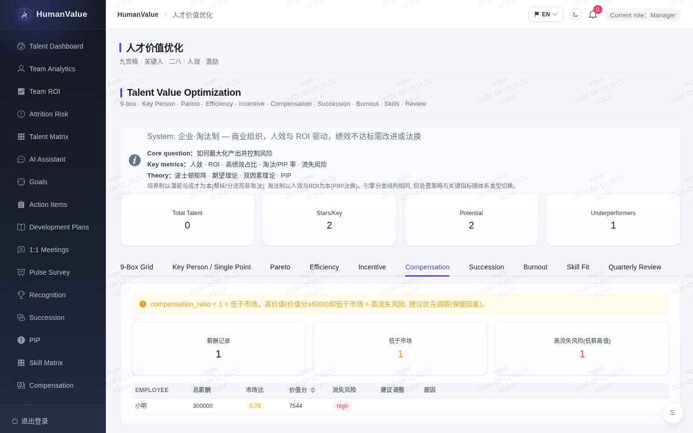 |

| 继任 | 倦怠 | 技能 | 复盘 |
|:---:|:---:|:---:|:---:|
| 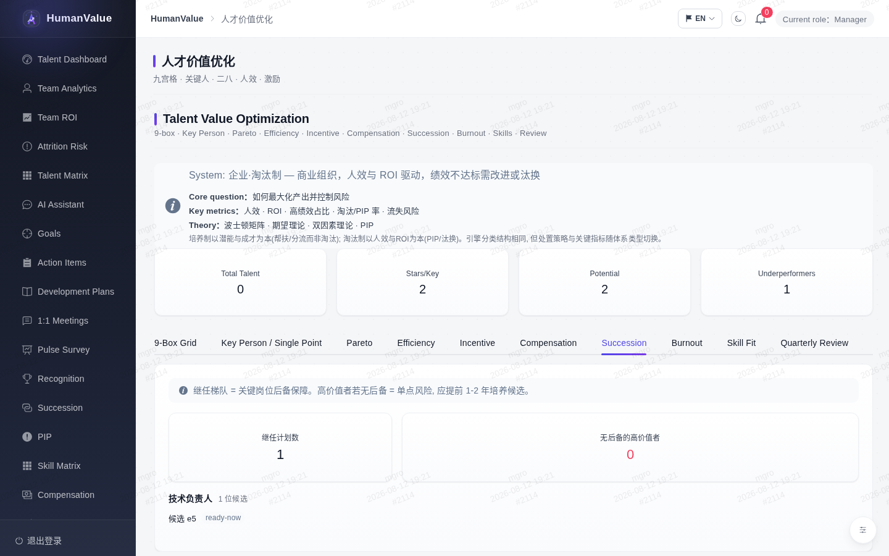 | 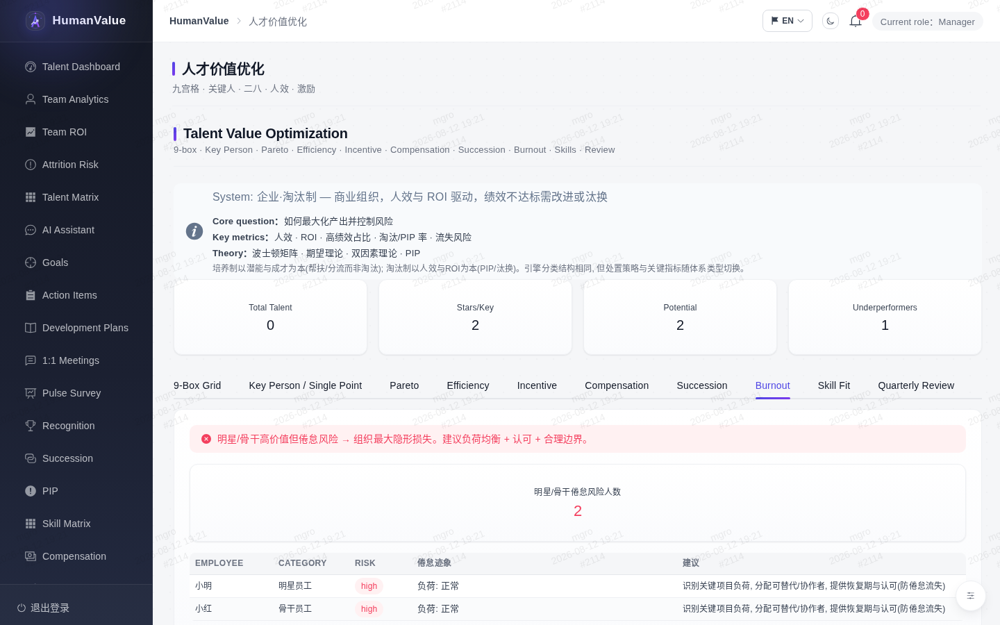 | 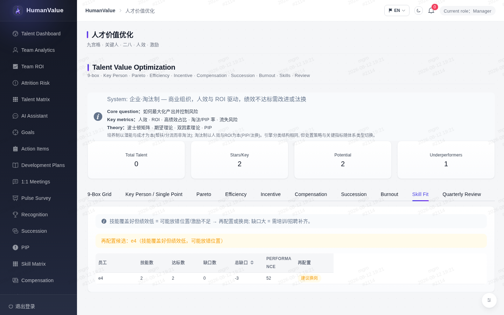 | 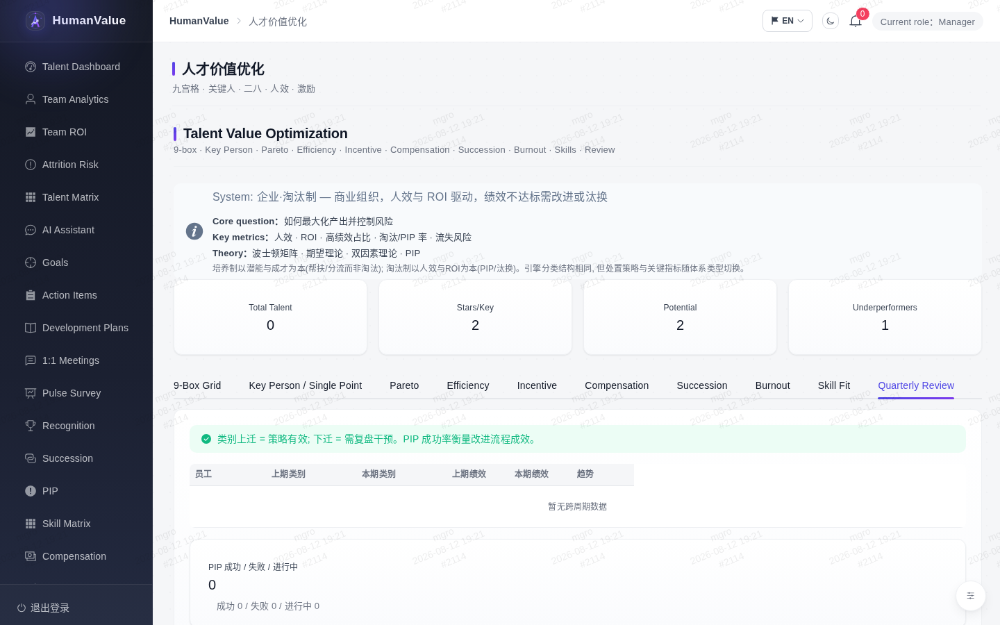 |

### AI 助手对话控制台
| 欢迎引导 | 对话（工具调用） | 多轮追问 |
|:---:|:---:|:---:|
| 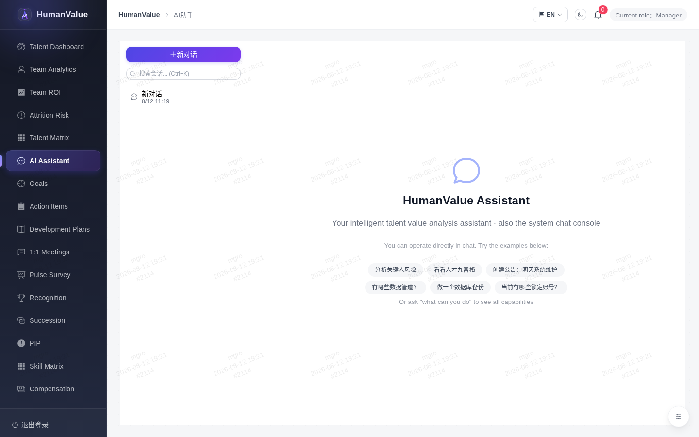 |  | 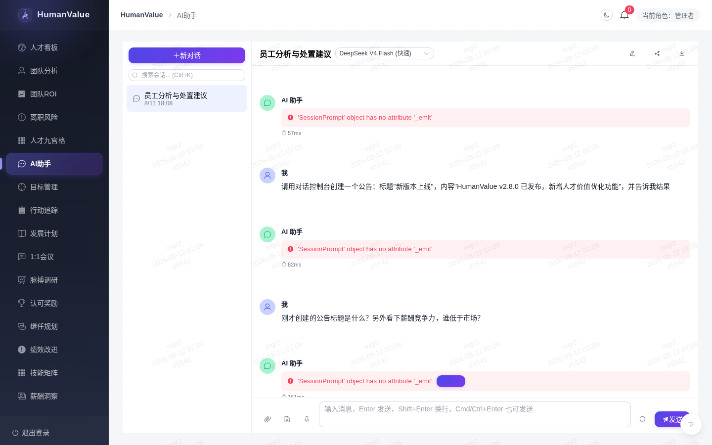 |

### 其他界面
| 暗色模式 | 快捷键 | 404 |
|:---:|:---:|:---:|
|  | 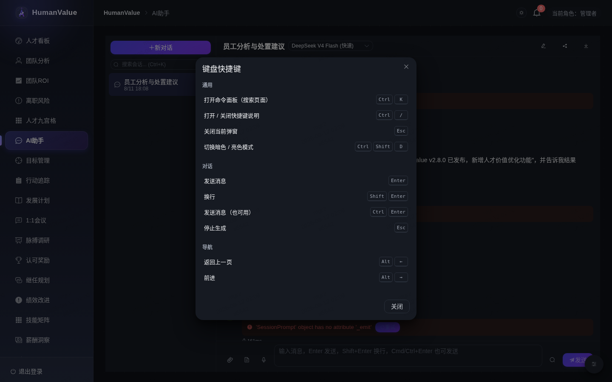 | 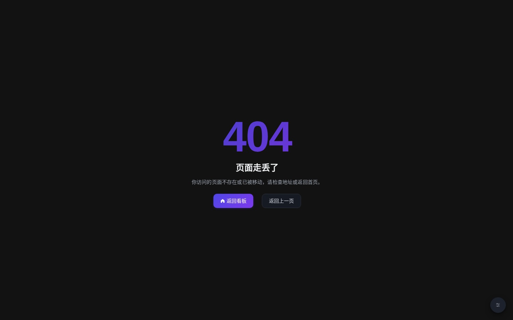 |
